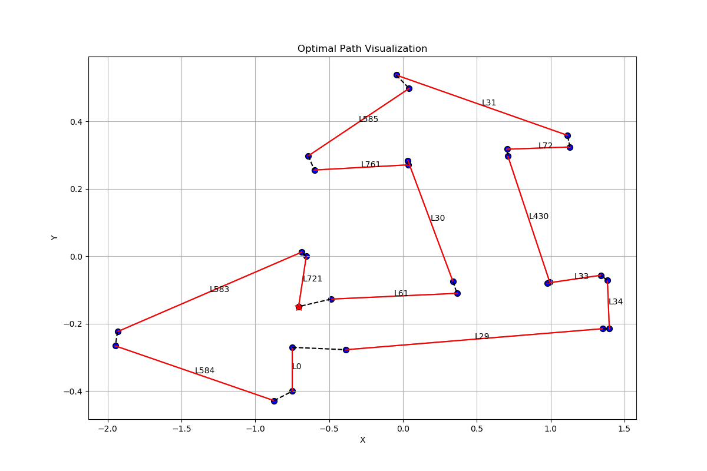

# Path_Planning_Base_Lines

## Note

```cpp
// -*- coding：utf-8 -*-
// @Author: Peitong Li
// @Email: 2311797@tongji.edu.cn
// @Time: 2025/08/26
// @Description: Path_Planning_Base_Lines
```

## Getting Started

### environment
```
cmake
gcc
matplotlib_cpp (refer here: https://github.com/lava/matplotlib-cpp.git)
python3 + matplotlib
```
### run
```
cd /path/to/Path_Planning_Base_Lines
mkdir build && cd build
cmake ..
make
./Path_Planning_Base_Lines
```

### output
Path_Planning_Base_Lines/info/res/test_box.png \
(The detailed results can be found in the Path_Planning_Base_Lines root folder, See terminal console)

### Visualization
