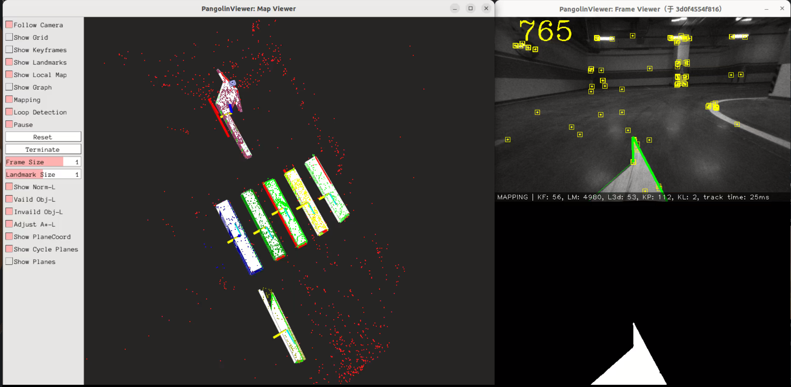
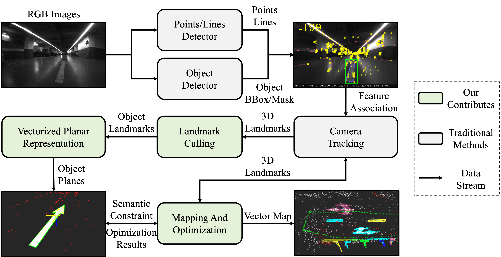
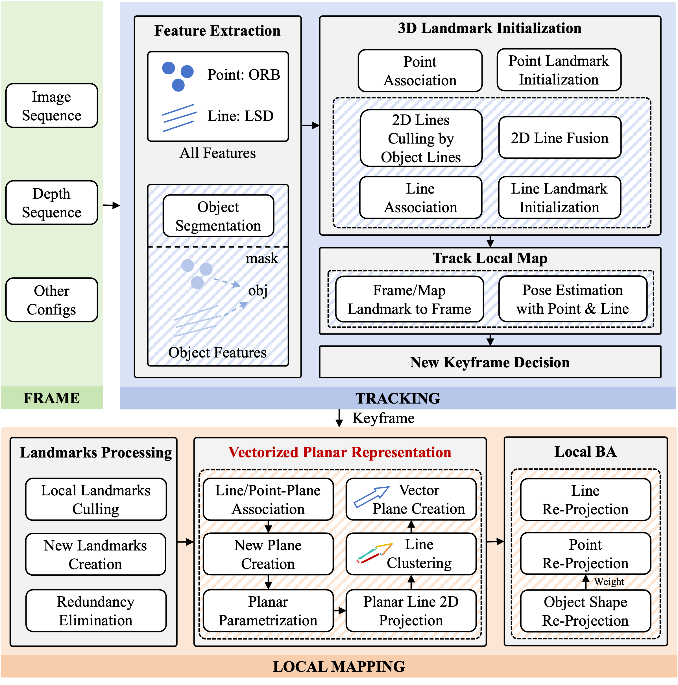
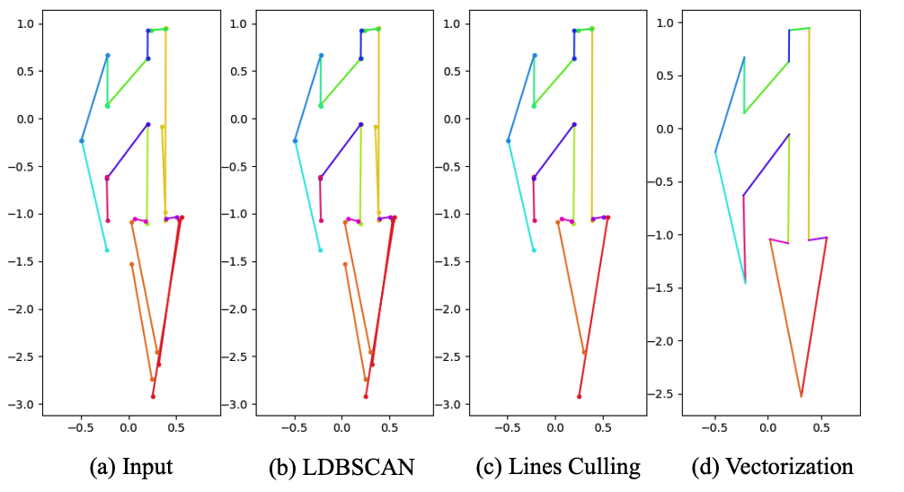
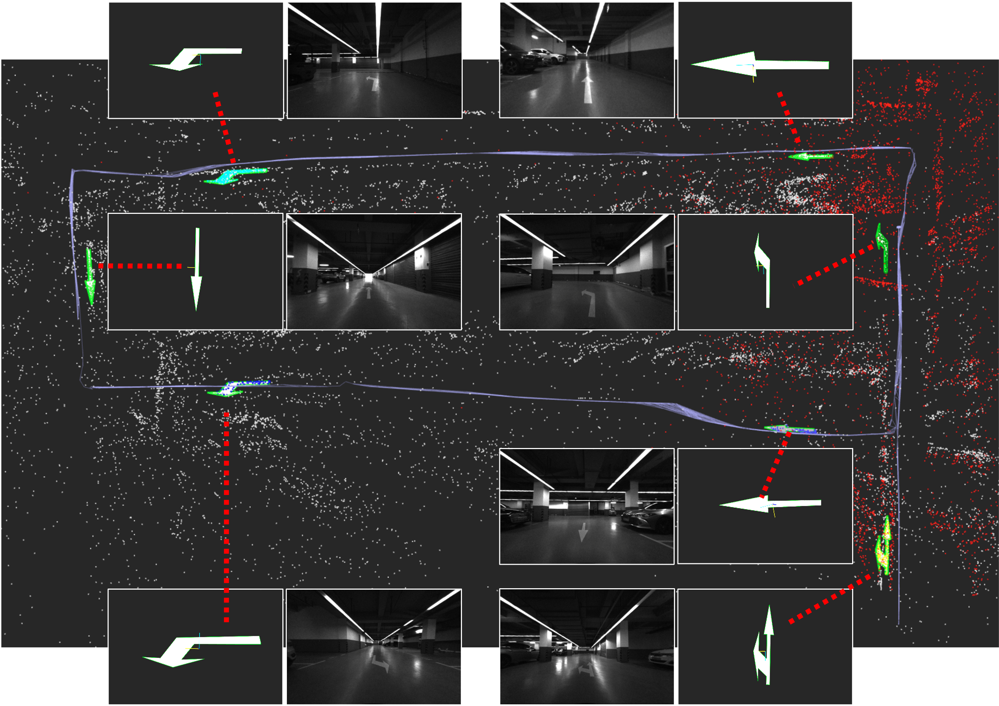
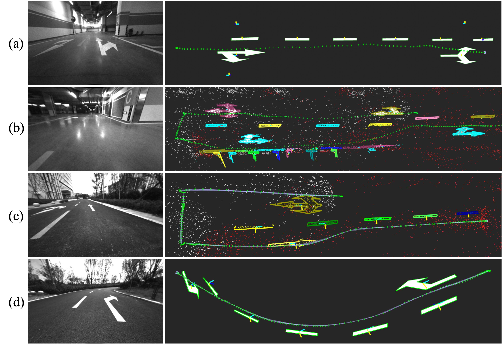
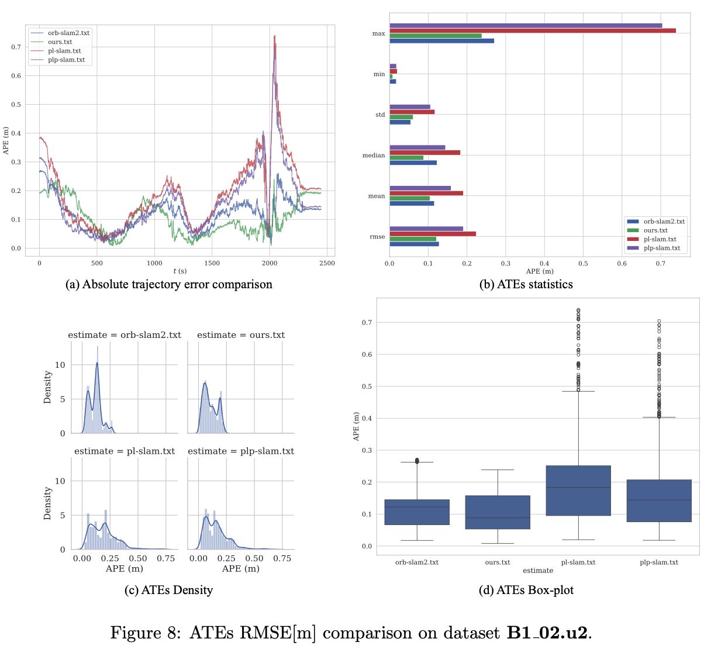
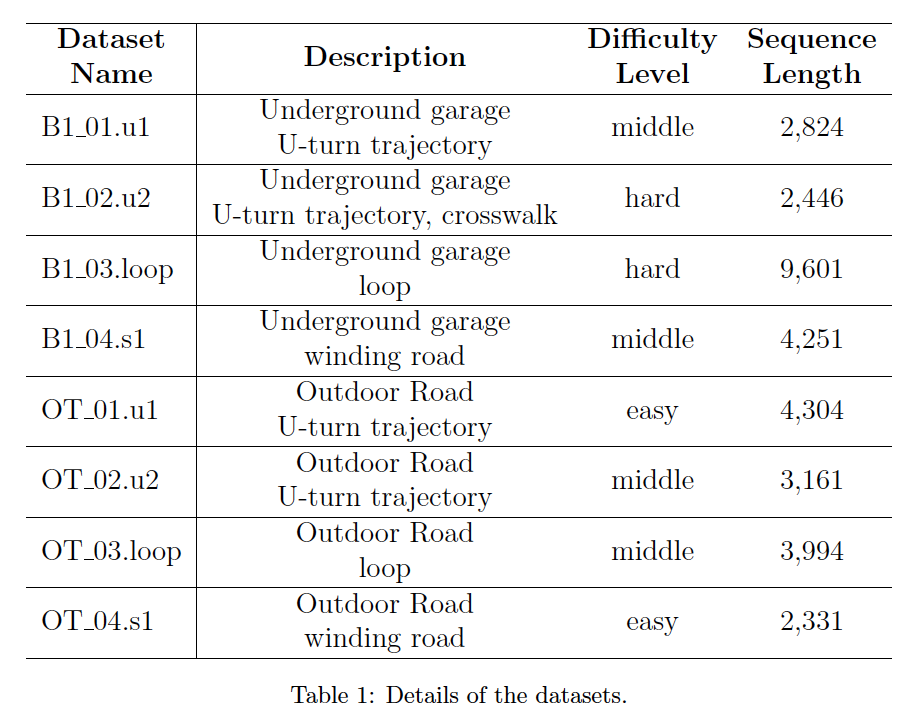

# VectoMark: Vectorized Road Markings Modeling for Visual SLAM in Public Transportation Environments
## 1. Experiments Videos (Click to jump)
YouTube [Here (default)](https://www.youtube.com/watch?v=5Isd0tu_a6w)

Bilibili [Here](https://www.bilibili.com/video/BV1471vBoEXb/?vd_source=a422a042a62840fe268651c9dbc91561)

## 2. Getting Started
Our work is based on PLP-SLAM, and all the code environments are the same as that of this project. ([code](https://github.com/peitonglee/Structure-PLP-SLAM-Backup.git))

### Plane_Obj_Vectorization demo
See [Here](./Plane_Obj_Vectorization/README.md)

### Path_Planning_Base_Lines demo
See [Here](./Path_Planning_Base_Lines/README.md)

## 3. The Graphical Abstract

## 4. The System Framework

## 5. Vectorized Planar Object Modeling

## 6. Mapping Visualization

## 7. 轨迹估计

## 8. The upcoming datasets (RoadMarkings_TJ)

you can download the datasets from the following links: [RoadMarkings\_TJ](https://pan.baidu.com/s/1X5R5Zsw1R28wVPfbhbnoVg?pwd=7C0D)

## Related Works
[1] F. Shu, et al. "Structure PLP-SLAM: Efficient Sparse Mapping and Localization using Point, Line and Plane for Monocular, RGB-D and Stereo Cameras". IEEE International Conference on Robotics and Automation (ICRA), 2023. (https://arxiv.org/abs/2207.06058) updated arXiv v3 with supplementary materials. 
